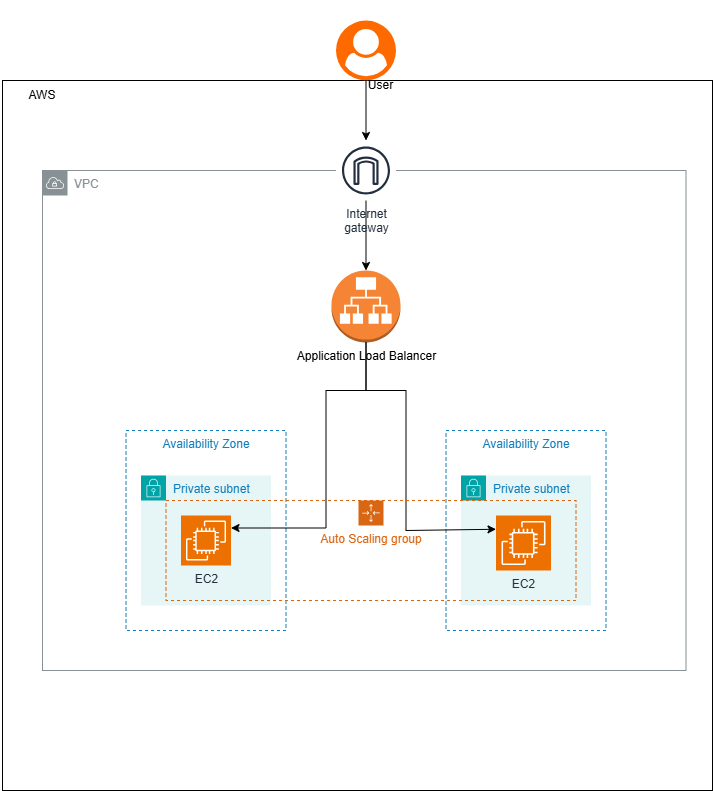
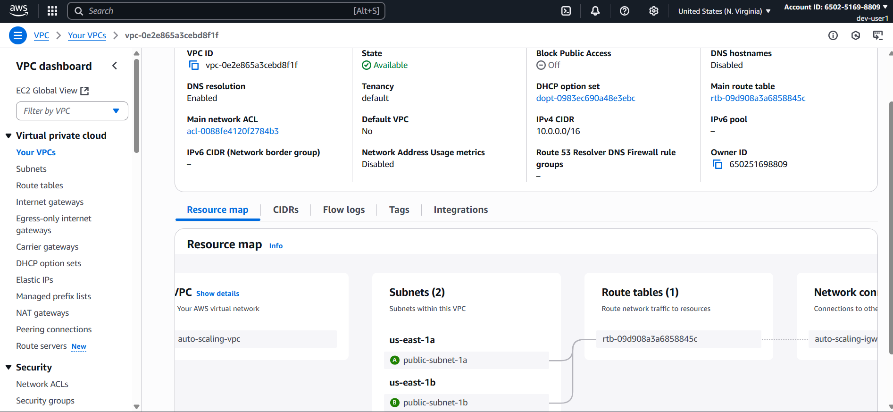
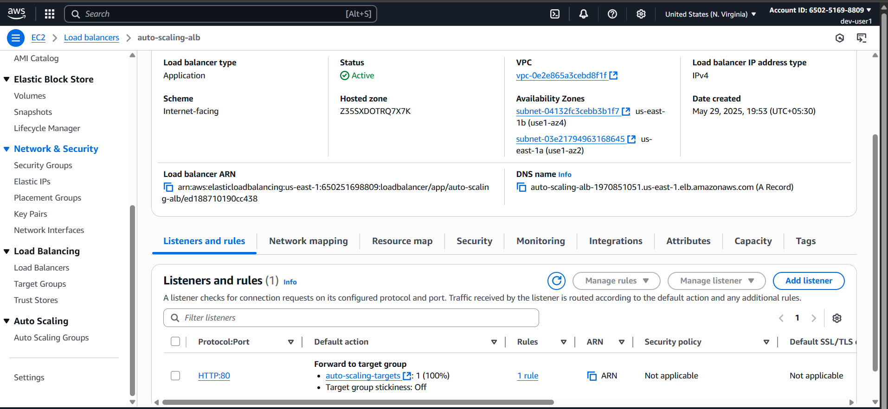
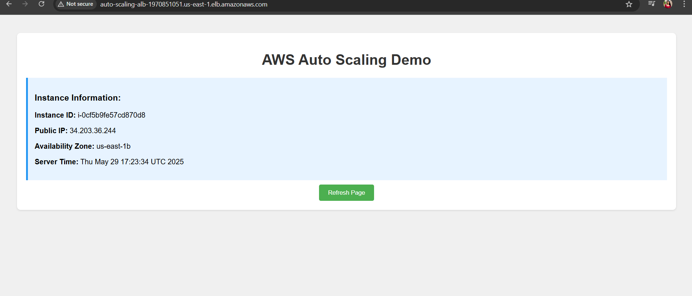
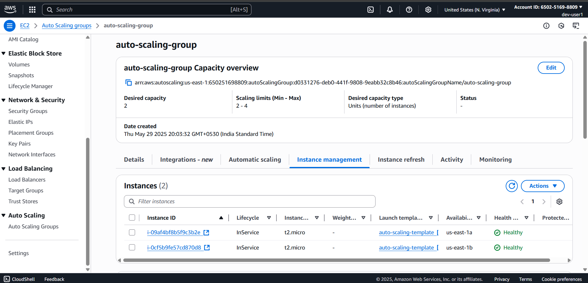
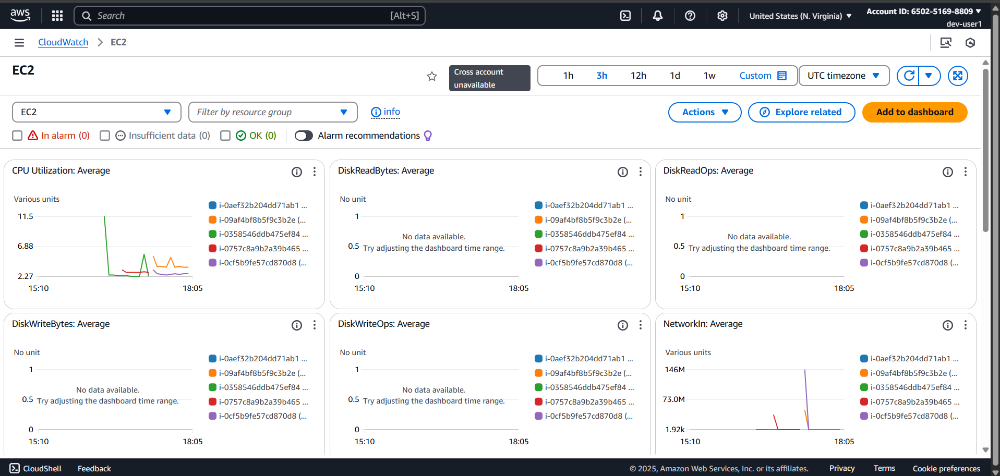

# 🚀 AWS Auto-Scaling Web Application

A highly available, scalable web application deployed on AWS using Auto Scaling Groups, Application Load Balancer, and custom VPC infrastructure.



## 🎯 **Project Overview**

This project demonstrates enterprise-level AWS infrastructure deployment with automatic scaling capabilities. The application can handle traffic spikes by automatically adding EC2 instances and provides high availability across multiple Availability Zones.


### **📊 Key Metrics**
- ⚡ **Response Time**: < 200ms average
- 🔄 **Auto-scaling**: CPU threshold at 50%
- 🏗️ **High Availability**: 99.9% uptime across 2 AZs
- 💰 **Cost Optimized**: Runs within AWS Free Tier

---

## 🛠️ **Technologies Used**

| **Category** | **Technology** | **Purpose** |
|--------------|----------------|-------------|
| **Cloud Platform** | AWS | Infrastructure hosting |
| **Compute** | EC2 (t2.micro) | Web server instances |
| **Load Balancing** | Application Load Balancer | Traffic distribution |
| **Auto Scaling** | Auto Scaling Groups | Dynamic capacity management |
| **Networking** | VPC, Subnets, IGW | Custom network architecture |
| **Monitoring** | CloudWatch | Metrics and alerting |
| **Security** | Security Groups, IAM | Access control |
| **Web Server** | Apache HTTP Server | Static content serving |

---

## 🏗️ **Architecture**

### **Infrastructure Components**
- **VPC**: Custom Virtual Private Cloud with public subnets across 2 AZs
- **Load Balancer**: Application Load Balancer for high availability
- **Auto Scaling**: Dynamic scaling based on CPU utilization (50% threshold)
- **EC2 Instances**: t2.micro instances running Amazon Linux 2
- **Security**: Layered security groups for ALB and EC2 instances

---

## 🚀 **Features**

### **✅ Implemented Features**
- [x] **Auto Scaling**: Automatic instance management (Min: 1, Max: 4)
- [x] **Load Balancing**: Traffic distribution across healthy instances
- [x] **High Availability**: Multi-AZ deployment for fault tolerance
- [x] **Health Monitoring**: ELB health checks with CloudWatch integration
- [x] **Cost Optimization**: Free tier compliant resource allocation
- [x] **Security**: Minimal exposure with security group restrictions
- [x] **Monitoring**: Real-time metrics and scaling activity logs

### **🔄 Auto-Scaling Behavior**
- **Scale Out**: CPU > 50% for 2 consecutive periods (5 minutes)
- **Scale In**: CPU < 50% for 2 consecutive periods (5 minutes)
- **Cooldown**: 300 seconds between scaling activities
- **Health Check**: 30-second intervals with 2 healthy/unhealthy thresholds

---

## 📸 **Screenshots**

### **Infrastructure Setup**
| VPC Configuration | Load Balancer Status |
|:-----------------:|:--------------------:|
|  |  |

### **Application Running**
| Website Interface | Auto Scaling Activity |
|:-----------------:|:---------------------:|
|  |  |

### **Monitoring & Metrics**



### **Deployment Steps**
1. **Clone Repository**
   ```bash
   git clone https://github.com/Samudini-Chamodya/aws-auto-scaling-web-app.git
   cd aws-auto-scaling-web-app
